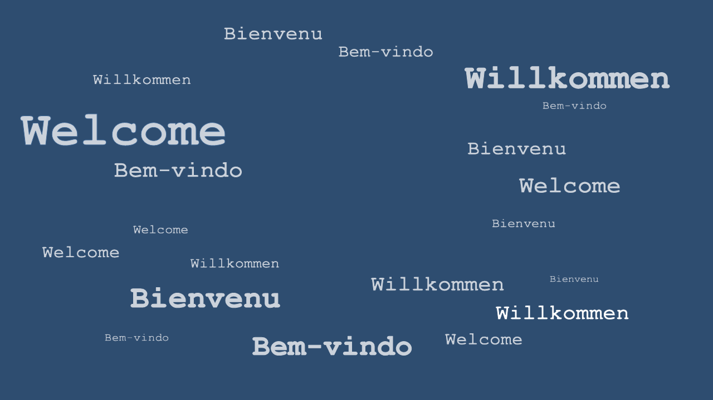

# Kai Streiling

{align=left width=300 id=round}

Hi there,  
I am a cognitive scientist, that is somebody concerned with the mechanics of (human) thinking. 
Specifically, my PhD topic resolves around the perception of causality and the Sense of Agency in human sensorimotor control.
I'll gladly tell you a bit more abouta my [current research](research.md) and [professional background](about.md), if you are interested. 
There are also annecdotal and hopefully easy to understand summaries for some of the topics in the [blog](./blog/Causality_SSD_and_Choice-History.md) section.

## Contact
Feel free to [write me an e-mail](mailto:kai.streiling@tu-darmstadt.de), if you have questions or feedback or discovered spelling mistakes ;).  
<!-- I am also always happy to talk about collaborations, projects, movies or technical fancicalities. -->

[:octicons-mail-16:](mailto:kai.streiling@tu-darmstadt.de){.md-button .md-button--primary }
[:fontawesome-brands-github:](https://github.com/uvest/){align=left .md-button .md-button--primary target=_blank}
[:simple-researchgate:](https://www.researchgate.net/profile/Kai-Streiling){.md-button .md-button--primary target=_blank}

 

---

{align=center width=100%}

<!-- :material-arrow-down:{align=center} -->

---

